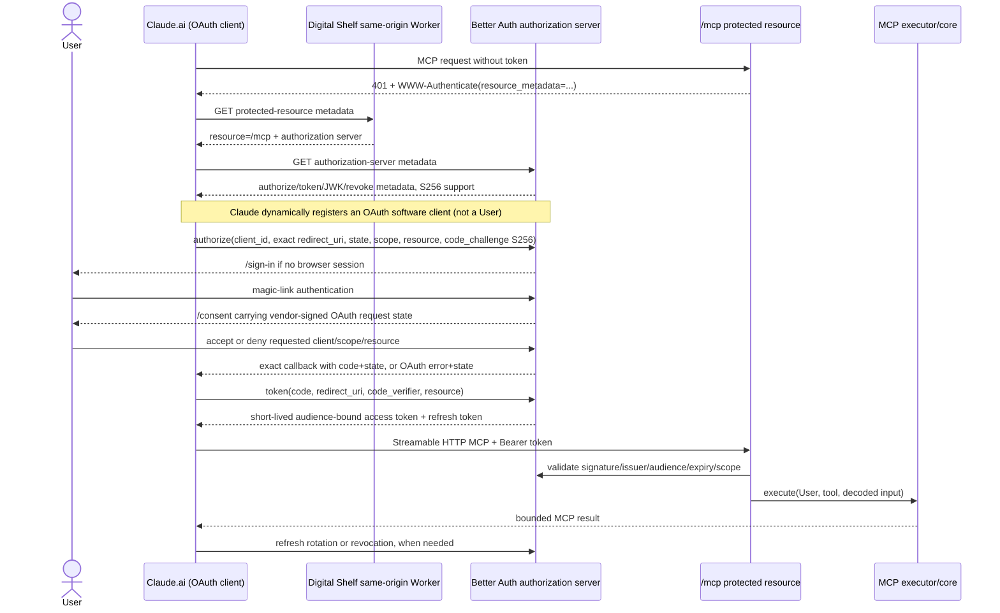

# Digital Shelf: MCP OAuth, Claude.ai, and Cloudflare Code Mode

**Status: RESEARCH COMPLETE; PRODUCT SCOPE AGREED — implementation awaits the user's final go-ahead. No implementation or live interoperability is claimed.**

**Review:** The parent checked the final report and spot-checked Claude's callback/registration documentation, pinned Cloudflare executor/network defaults, and local auth/routing. The separate evidence-auditor could not run because its retrieval tools were unavailable; this is not a completed independent audit.

- **Research date:** 2026-09-13 UTC
- **Digital Shelf revision:** `prototype/listing-workspace` at `1eb7fa2af407c65c12a7af7325caa9dedb77d4e4`
- **Pinned relevant dependencies:** Better Auth / `@better-auth/mcp` **1.7.3**; Effect **4.0.0-rc.112**; Alchemy **2.0.0-beta.77**
- **Maple comparison revision:** [`MapleTechLabs/maple@7a2982c87e60f5adb6699f9c470c41d9e62c4290`](https://github.com/MapleTechLabs/maple/tree/7a2982c87e60f5adb6699f9c470c41d9e62c4290)
- **Cloudflare Agents/Code Mode revision:** [`cloudflare/agents@46760e635ce9599add0abbfe6c1a34af0d5d44f1`](https://github.com/cloudflare/agents/tree/46760e635ce9599add0abbfe6c1a34af0d5d44f1), package `@cloudflare/codemode@0.5.2`
- **Cloudflare docs revision:** [`cloudflare/cloudflare-docs@77f649f25b3bdd0d8658e48ff8f9ede5dd6079d5`](https://github.com/cloudflare/cloudflare-docs/tree/77f649f25b3bdd0d8658e48ff8f9ede5dd6079d5)
- **Cloudflare OAuth Provider revision:** [`cloudflare/workers-oauth-provider@a6c2e4a29d0fdae53caf47c7974c70b428c4145e`](https://github.com/cloudflare/workers-oauth-provider/tree/a6c2e4a29d0fdae53caf47c7974c70b428c4145e), package `0.10.3`
- **MCP specification revision:** [`modelcontextprotocol/modelcontextprotocol@cc2a84f5ca5404b2949683f7d7876f623344294f`](https://github.com/modelcontextprotocol/modelcontextprotocol/tree/cc2a84f5ca5404b2949683f7d7876f623344294f)

> **Evidence labels.** **VERIFIED** means inspected repository code, pinned upstream source, or current first-party product documentation. **RECOMMENDATION** is proposed Digital Shelf design. **LIVE INTEROP NOT TESTED** means no deployed Claude.ai/OAuth/MCP exchange was performed; product documentation is not a substitute for that smoke test. Remote content was treated as untrusted research material and was not executed.

## Confirmed product decisions

- Target Claude.ai web: paste the existing origin's `/mcp` URL, then use Digital Shelf sign-in and consent. No manually entered client credentials.
- One consent grant covers **all user-facing features exposed through MCP**, not Brand-only authorization or selectable per-feature read/write scopes. Existing Users retain the shared-pool model; tool availability and safety checks still constrain what a client can execute.
- **Brands CRUD is the first implementation and test slice.** Other user-facing tools follow in later slices under the same full-feature grant. This limits the first delivery's tool catalog, not its permission model.
- MCP may delete only an Empty Brand (no Products and no Pages), enforced atomically through core. Existing API cascading deletion is unchanged.
- Access tokens last **15 minutes**; refresh tokens last **30 days** and rotate. Reconnection after refresh expiry is acceptable. Verify whether provider rotation resets expiry and document the actual revocation delay; no unverified claim of immediate access-token invalidation.
- Claude remains connected across browser sessions. Browser logout does not revoke its OAuth grant; explicit grant revocation stops refresh.
- Include a minimal **Connected apps** page for the User to view and revoke their grants; no separate administration system.
- Research Code Mode now; implement its execution surface after the OAuth/CRUD foundation.

## Executive recommendation — provisional, not approval

Build a **minimal, same-host `/mcp` foundation first**, retaining Better Auth 1.7.3 as the sole authorization server and the existing allowlisted magic-link login as the human authentication step. Add: reliable well-known and `/mcp` routing, URL-only Claude.ai Dynamic Client Registration (DCR) with explicit safeguards, a real consent experience, bearer-token protection with exact issuer/audience/scope validation, a stateless-or-isolate-safe Streamable HTTP transport, one bounded **Brands CRUD** vertical slice, and complete negative-path tests.

The confirmed product decisions above control this proposal. Consent grants full access to the published MCP feature surface, rather than Brand-specific permissions. The confirmed Brands-first delivery limits available tools, not the grant's authorization model; other feature tools follow later. Consent must clearly communicate full shared-data access, including writes and supported deletes. Protocol compatibility, DCR request details, refresh expiry semantics and post-revocation access-token latency remain engineering validation work. Implementation awaits the user's final go-ahead.

Treat Cloudflare Code Mode as a later, independent phase. OAuth establishes who may call Digital Shelf; Code Mode changes how an already-authorized model composes operations. Do not make OAuth depend on a sandbox, Worker Loader, generated code, or Code Mode package.

## 1. Terminology and preserved domain meaning

The existing **User** glossary meaning must remain unchanged: an allowlisted, authenticated person with the application's current shared-data/full-access model. OAuth introduces separate security objects; none is a synonym for User:

| Term | Meaning in this design | Not the same as |
|---|---|---|
| **User** | Existing Digital Shelf human identity (`id`, `email`), authenticated through magic link and subject to the current domain allowlist. | OAuth client, grant, scope, sandbox. |
| **OAuth client** | Software requesting delegated access—here, Claude.ai or a client instance/registration. | The human using Claude.ai. |
| **Consent grant** | A User's recorded approval for a client, requested scopes, and resource. | Login session or general user authorization policy. |
| **Scope** | OAuth constraint attached to a grant/token and checked at `/mcp`. Start with an explicit MCP scope rather than silently treating login as bearer authority. | A role, workspace, or entity ownership rule. |
| **Resource** | Canonical protected-resource identifier, proposed/currently configured as `${AUTH_BASE_URL}/mcp`. | Request `Host`, API root, or callback URI. |
| **Sandbox execution** | Later execution of model-produced code in a constrained runtime, with only deliberately bridged capabilities. | OAuth authentication or consent. |

These terms are **documentation/ADR proposals only** until the project explicitly adopts them. They do not modify `CONTEXT.md`. Full-access User means application data is shared among admitted users; it does **not** mean every OAuth client, grant, scope, or generated program should automatically receive unlimited or destructive authority.

## 2. Current implementation versus missing foundation

| Capability | Implemented at pinned HEAD | Missing / not proved |
|---|---|---|
| Human login | Better Auth magic-link login, allowlisted domain, session cookie, sign-in UI, callback/origin hardening and tests ([`Auth.ts:34-111`](../../packages/core/src/Auth/Auth.ts), [`Allowlist.ts:1-19`](../../packages/core/src/Auth/Allowlist.ts), [`Http.test.ts:11-161`](../../packages/core/test/Auth/Http.test.ts)). | Live production login was not exercised. |
| OAuth provider foundation | `mcp(...)` configures `/sign-in`, `/consent`, and the resource `${baseURL}/mcp`; OAuth/JWK/client/resource/token/consent tables exist ([`Auth.ts:45-49,80-111`](../../packages/core/src/Auth/Auth.ts), [`Auth.ts:102-300`](../../packages/domain/src/Sql/Auth.ts)). | End-to-end authorization, metadata contents, token claims, refresh and revocation are untested. |
| Discovery routing | `/api/auth/*` and `/.well-known/*` are forwarded to Better Auth ([`AuthRoutes.ts:24-27`](../../packages/api/src/Auth/AuthRoutes.ts)). | Worker assets are only explicitly bypassed for `/api/*` and `/health`; deployed reachability of well-known routes is unproved ([`Worker.ts:30-39`](../../apps/server/src/Worker.ts)). |
| Client registration | Provider storage/schema exists. Anthropic documents Claude.ai DCR and URL-only connector setup. Pinned `mcp()` delegates OAuth options that can enable open DCR. | DCR and unauthenticated registration both default off; callback/method behavior still needs a live Claude.ai trace; DCR policy gates are not configured. |
| Consent | Better Auth is configured to redirect to `/consent`; provider has a signed-query consent endpoint. | No consent route/component/action exists, so an approval flow cannot finish. |
| Protected resource | Pinned `@better-auth/mcp` exposes protected-request helpers that validate signature, issuer, audience, expiry, optional scopes and DPoP. | No `/mcp`; no use of `requireMcpAuth`/protected handler; cookie middleware is not bearer protection. |
| MCP transport | None. | No Streamable HTTP handler, MCP SDK dependency, initialization, tools, resources, or prompts. |
| Tool execution | Existing Brand core features and typed schemas can be called by a thin adapter. Brands CRUD is confirmed, including delete only when the Brand has no descendants. | No MCP catalog/executor; the MCP-only empty-Brand deletion rule does not exist. |
| Invocation safety | Auth is lazy/cached and each request runs through `withInvocation`, preserving the request-owned DB context ([`Auth.ts:116-153`](../../packages/core/src/Auth/Auth.ts), [`BetterAuthAdapter.ts:46-91`](../../packages/core/src/Auth/BetterAuthAdapter.ts); ADR 0010). | New MCP/auth operations must prove they do not capture request sockets/context in the once-built graph. |
| Claude.ai compatibility | **VERIFIED (documentation):** Claude supports Streamable HTTP, auth revisions `2025-03-26`, `2025-06-18`, and `2025-11-25`, DCR, custom credentials for non-DCR servers, token refresh/expiry, and hosted callback `https://claude.ai/api/mcp/auth_callback` ([Claude connector-building docs](https://claude.com/docs/connectors/building)). | **LIVE INTEROP NOT TESTED:** exact requests, client authentication choice, discovery fallback, protocol negotiation, and refresh behavior remain unobserved against Digital Shelf. |
| Code Mode | Nothing exists in Digital Shelf or Maple. **VERIFIED (upstream):** Cloudflare publishes experimental `@cloudflare/codemode@0.5.2`, using Worker Loader dynamic isolates, RPC capability bridges, and optional Durable Object-backed runtime state. | Hosted Worker Loader is closed beta; no compatibility test with this repo's Effect/Alchemy graph; Code Mode is not required for the OAuth/CRUD foundation. |

**Conclusion:** the repository has OAuth-provider groundwork, not an operational or Claude.ai-verified MCP server.

## 3. OAuth and MCP sequence



### Trust boundaries

1. **Browser/User ↔ Claude.ai:** Claude controls client behavior and callback handling; Digital Shelf must bind authorization to `client_id`, exact callback, `state`, PKCE, resource, and scopes.
2. **Internet ↔ same-origin Worker:** all headers, JSON-RPC inputs, OAuth parameters, and discovery requests are untrusted. Canonical issuer/resource must come from configuration, never `Host`/forwarded headers.
3. **OAuth provider ↔ `/mcp`:** successful browser login is not sufficient. `/mcp` accepts bearer authority only after token validation and required-scope checks.
4. **MCP transport ↔ executor:** tool name and input are model-controlled. The executor performs closed catalog lookup and schema decoding before calling core.
5. **Executor ↔ core/database:** business rules and transactions remain in core feature services. MCP adapters never use repositories directly.
6. **Later Code Mode sandbox ↔ capability bridge:** generated code is hostile input. It gets no secrets, DB binding, arbitrary network, raw Worker environment, or unconstrained dynamic dispatch—only a least-privilege capability/RPC surface.

## 4. Exact requirements for a Claude.ai connection

The following separates MCP standards, Claude product behavior, pinned provider behavior, and facts that still require a live Digital Shelf exchange.

### 4.1 Transport and discovery

- **VERIFIED — MCP:** Streamable HTTP uses one endpoint supporting POST and GET; GET may return `405` when no standalone SSE stream is offered. Servers must validate a present `Origin` and return `403` when invalid. Stateful sessions are optional; if assigned, the client sends `MCP-Session-Id` thereafter. Every later request carries `MCP-Protocol-Version` ([pinned 2025-11-25 transport](https://github.com/modelcontextprotocol/modelcontextprotocol/blob/cc2a84f5ca5404b2949683f7d7876f623344294f/docs/specification/2025-11-25/basic/transports.mdx)).
- **VERIFIED — MCP auth:** protected servers publish RFC 9728 metadata, advertise it in a Bearer `WWW-Authenticate` challenge or at a well-known path, and bind tokens with RFC 8707 `resource`. The 2025-11-25 revision supports pre-registration, Client ID Metadata Documents (CIMD), and DCR, in that preference order for clients supporting all three ([pinned authorization](https://github.com/modelcontextprotocol/modelcontextprotocol/blob/cc2a84f5ca5404b2949683f7d7876f623344294f/docs/specification/2025-11-25/basic/authorization.mdx)).
- **VERIFIED — version evolution:** 2025-03-26 centered authorization-server metadata and recommended DCR; 2025-06-18 added mandatory protected-resource metadata and `resource`; 2025-11-25 adds CIMD and path-specific discovery rules. Supporting one revision is not equivalent to supporting them all.
- **VERIFIED — Claude product docs:** Claude supports Streamable HTTP (legacy HTTP+SSE is deprecated) and auth revisions `2025-03-26`, `2025-06-18`, and `2025-11-25` ([building custom connectors](https://claude.com/docs/connectors/building)).
- **VERIFIED — pinned Better Auth:** `@better-auth/mcp@1.7.3` serves root and path-suffixed protected-resource metadata; its provider advertises S256 and only advertises registration when enabled (local installed-source evidence recorded in the companion inventory).

**RECOMMENDATION:** route `/mcp`, `/mcp/*`, `/.well-known/oauth-protected-resource`, `/.well-known/oauth-protected-resource/mcp`, and authorization-server discovery through the Worker before SPA assets. Challenge unauthenticated `/mcp` requests; do not redirect protocol requests to browser sign-in. Validate `Origin` when present with an explicit production allowlist compatible with observed Claude behavior. Prefer a stateless endpoint for the first slice; the MCP spec allows the server not to assign a session.

**LIVE INTEROP NOT TESTED:** Claude's actual discovery order, `Origin`, negotiated protocol version, GET use, and session behavior against Digital Shelf remain release evidence, not assumptions.

### 4.2 URL-only Claude.ai DCR, callback, and per-user login

Short quotations from the two re-read official Claude pages:

- Setup: **“Add your connector's remote MCP server URL.”** ([Claude Help](https://support.claude.com/en/articles/11175166-get-started-with-custom-connectors-using-remote-mcp))
- Credentials are optional: **“Optionally, click “Advanced settings” to specify an OAuth Client ID and OAuth Client Secret for your server.”** ([Claude Help](https://support.claude.com/en/articles/11175166-get-started-with-custom-connectors-using-remote-mcp))
- Client registration: **“Dynamic Client Registration (DCR) enabled”** and **“Custom credentials for non-DCR servers”** ([building custom connectors](https://claude.com/docs/connectors/building))
- Hosted callback: **“OAuth callback: https://claude.ai/api/mcp/auth_callback (hosted surfaces); loopback redirect for Claude Code”** ([building custom connectors](https://claude.com/docs/connectors/building))
- Per-user authorization: **“users individually connect to and enable that connector”** and then **“Click "Connect" to authenticate and start using the connector with Claude.”** ([Claude Help](https://support.claude.com/en/articles/11175166-get-started-with-custom-connectors-using-remote-mcp))

These statements support the required Claude.ai web sequence: enter only `${origin}/mcp`; Claude discovers and dynamically registers its OAuth **software client**; the browser then reaches Digital Shelf sign-in and consent for the existing User. DCR is client registration, not human signup and not a second identity system. The existing magic-link allowlist remains the only User-admission path.

**VERIFIED — exact pinned Better Auth 1.7.3 behavior:** `McpOptions` extends the delegated OAuth provider's options, and `mcp()` spreads those options into `oauthProvider()`. For a registration request arriving before a Digital Shelf browser session and without an initial access token, URL-only DCR requires **both**:

```ts
allowDynamicClientRegistration: true
allowUnauthenticatedClientRegistration: true
```

The first switch enables `POST /oauth2/register` and causes authorization-server metadata to include `registration_endpoint`; the second permits that endpoint without a User session or initial access token. Both default to `false` (`@better-auth/oauth-provider@1.7.3`, installed `dist/oauth-1Ud-hvZY.d.mts:1273-1301`; runtime `dist/authorize-9whjxVLJ.mjs:696,740-750,1720-1749,4204-4209`; delegation in `@better-auth/mcp@1.7.3/dist/index.mjs:169-177`).

For `token_endpoint_auth_method: "none"`, the provider creates a public client with no client secret; registered public clients require PKCE. The default registration method is otherwise `client_secret_basic`, which creates and returns a one-time secret automatically. **URL-only does not imply a public OAuth client:** DCR can provision credentials between client and server without human entry. **LIVE INTEROP NOT TESTED:** capture Claude.ai's actual DCR body and support its compatible advertised method, without inventing a client ID or falling back to manual credentials (`authorize-9whjxVLJ.mjs:1627-1636,1908-1933`; provider types `oauth-1Ud-hvZY.d.mts:1273-1286`).

`mcp()` automatically adds `${AUTH_BASE_URL}/mcp` to the provider resources and dynamic-client default resources. Registration scope metadata is checked against `clientRegistrationDefaultScopes` plus `clientRegistrationAllowedScopes`; this establishes client capability but does **not** grant a User those scopes. User authorization still happens later through sign-in and consent (`@better-auth/mcp/dist/index.mjs:172-176`; provider types `oauth-1Ud-hvZY.d.mts:1342-1379`).

**RECOMMENDATION — required open-DCR safeguards:** the provider's generic web redirect validation allows any non-loopback HTTPS callback; it does not by itself restrict registration to Claude's hosted callback. Add an application-owned DCR request gate that accepts exactly `https://claude.ai/api/mcp/auth_callback`, authorization-code and refresh-token grants with response type `code`, and only provider-supported token authentication methods compatible with Claude's observed registration. Deny unrelated grants such as `client_credentials` and excess redirect/resource/scope metadata. Do not reject automatically provisioned confidential-client credentials merely because the human setup is URL-only. Keep the MCP resource as the only default/allowed resource; configure only approved scopes; retain PKCE; retain or tighten the provider's registration rate limit (default `5` per `60` seconds); add client-count/retention/disable controls and abuse telemetry. Treat `client_name` and other open-DCR metadata as self-asserted in consent UI. The installed provider already rejects missing code-flow redirects, fragments/credentials, insecure web redirects, unsupported grants/methods/scopes/resources, and later requires the authorization redirect to exactly match a stored redirect (`authorize-9whjxVLJ.mjs:1648-1718,1774-1797,5552-5558`; rate-limit types `oauth-1Ud-hvZY.d.mts:1836-1895`).

Pre-registration remains a technically supported alternative for managed integrations, but it is **not chosen** because the required user experience forbids manual Client ID/Secret entry. Do not invent or document a static well-known Claude `client_id`. CIMD is also not proposed for this flow.

### 4.3 Authorization, login, consent, callback

- Use authorization code flow with PKCE **S256**. MCP clients must verify advertised PKCE support; pinned Better Auth requires PKCE for registered clients by default.
- Bind and validate `client_id`, exact registered `redirect_uri`, `state`, `resource`, scopes, challenge, and response type. Never derive canonical issuer/resource from request `Host` or forwarded headers.
- Preserve the existing allowlisted magic-link User flow. After login, continue only the provider-signed OAuth request.
- Implement `/consent`. For open DCR, the registered client name is self-asserted, so display it as unverified alongside the exact registered callback host, resource, scopes, current User email, and truthful data/write consequences. Accept/deny should use Better Auth's session-protected consent endpoint and preserve its signed query; UI fields do not reconstruct authority.
- Denial/errors return only to a validated exact callback with the original state. Never redirect an unknown client or invalid redirect URI.

### 4.4 Token exchange and protected-resource validation

- Exchange a single-use code with the same client, exact redirect, resource, and PKCE verifier.
- MCP requires `Authorization: Bearer` on every HTTP request, no query-string token, intended-audience validation, `401` for missing/invalid/expired credentials, and `403` for insufficient scope ([2025-11-25 authorization, Access Token Usage](https://github.com/modelcontextprotocol/modelcontextprotocol/blob/cc2a84f5ca5404b2949683f7d7876f623344294f/docs/specification/2025-11-25/basic/authorization.mdx#access-token-usage)).
- At `/mcp`, validate signature, canonical issuer, exact `${AUTH_BASE_URL}/mcp` audience, time claims, revocation behavior, and required scope. `CurrentUserMiddleware` is cookie authentication and cannot substitute for bearer validation.
- Resolve the validated subject to the existing admitted User and pass that identity server-side to the closed executor. Never accept a user ID from tool input.

### 4.5 Claude limits and lifecycle

- **VERIFIED — Claude product docs:** token refresh and expiry are supported. Claude.ai/Desktop tool calls have a documented 240-second timeout and approximately 150,000-character maximum result. Claude Code has separately configurable `MCP_TOOL_TIMEOUT` and `MAX_MCP_OUTPUT_TOKENS`. These are Claude limits, not safe Digital Shelf defaults ([building custom connectors](https://claude.com/docs/connectors/building)).
- **VERIFIED — surface distinction:** the Messages API MCP connector accepts a caller-supplied bearer token and currently supports tools only; it is not evidence for Claude.ai's interactive OAuth behavior ([API MCP connector](https://platform.claude.com/docs/en/agents-and-tools/mcp-connector)).
- Pinned Better Auth defaults observed in installed source are 10-minute codes, one-hour access tokens, 30-day refresh tokens, hashed tokens/secrets, and a 30-second MCP refresh-token reuse interval. These are vendor defaults, not approved policy.

**CONFIRMED LIFECYCLE POLICY:** issue 15-minute access tokens and 30-day rotating refresh tokens so Claude.ai remains connected across browser sessions. Reconnection after refresh expiry is acceptable; verify whether rotation resets the 30-day expiry. Browser logout ends the Digital Shelf browser session only and does not revoke the OAuth grant. Include a minimal Connected apps page where each User can view and revoke their own grants; grant ownership is not data tenancy. After explicit revocation, the next refresh attempt must fail. Already-issued access tokens may remain usable until provider invalidation or expiry; document and test that measured delay. Validate the pinned provider's `offline_access`/issuance settings, rotation/reuse and replay/family-revocation semantics rather than assuming its defaults satisfy these policies. Digital Shelf outputs should remain materially smaller than Claude's maximum and lists must paginate.

**LIVE INTEROP NOT TESTED:** callback acceptance, PKCE exchange, token authentication method, refresh rotation, revocation, timeout, and output handling have not been exercised with Claude.ai.

## 5. Dependency choices

| Choice | Evidence and maturity at this repo | Integration cost | Advantages | Risks / caveats | Provisional disposition |
|---|---|---:|---|---|---|
| **Keep Better Auth 1.7.3 + `@better-auth/mcp`** | Already configured; schema/migration and request-scoped adapter exist; exact installed MCP and delegated provider source supports open DCR options. | **Low–medium** | One auth server; preserves magic-link User flow; resource metadata, DCR, and token helpers exist; least schema churn. | Consent, route, MCP transport, open-DCR policy gate and E2E tests still missing. Version is pinned; current upstream behavior may differ. | **Recommended foundation.** Upgrade only for a demonstrated requirement. |
| **Upgrade/use a modern Better Auth OAuth/MCP alternative (including possible CIMD path)** | Current MCP 2025-11-25 defines CIMD, but compatibility of the repo's pinned Better Auth version and any upgrade migration was not established from version-matched source. | **Medium–high** | May align with newer client registration behavior. | Not necessary for documented Claude DCR/custom-credential paths; remote client-metadata fetching adds SSRF risk; schema/API changes need review. | Evaluate only for a demonstrated interop requirement. Not a drop-in assumption. |
| **Cloudflare `@cloudflare/workers-oauth-provider@0.10.3`** | **VERIFIED:** MIT package; combined or split authorization/resource-server APIs; RFC 9728 challenge/metadata, RFC 8414 metadata, S256 PKCE, audience checks, refresh/revocation, pre-registration, optional CIMD and DCR; KV persistence ([pinned README](https://github.com/cloudflare/workers-oauth-provider/blob/a6c2e4a29d0fdae53caf47c7974c70b428c4145e/README.md), [license](https://github.com/cloudflare/workers-oauth-provider/blob/a6c2e4a29d0fdae53caf47c7974c70b428c4145e/LICENSE.txt)). The app still owns authentication and consent. | **High** | Worker-native protected-route wrapper and explicit resource APIs. | Would replace/duplicate Better Auth OAuth lifecycle, KV persistence, consent, identity bridge, and migration/test surface; no Digital Shelf integration or Claude smoke. CIMD requires strict-public fetch configuration. | **Do not adopt by default.** Revisit only if pinned Better Auth has a proven blocker. |
| **Custom OAuth server patterned after Maple** | Maple demonstrates a tested implementation but source is FSL-1.1-ALv2 and product-specific. | **Very high** | Maximum lifecycle control. | Duplicates existing provider; security-critical custom protocol; FSL legal caveat; org/role/key model does not fit. | Reject as foundation. Architectural reference only. |

## 6. Cloudflare Code Mode: separate phase and security model

### 6.1 Verified product and source facts

- **VERIFIED:** `@cloudflare/codemode@0.5.2` is MIT-licensed and marked experimental; breaking changes are expected ([package](https://github.com/cloudflare/agents/blob/46760e635ce9599add0abbfe6c1a34af0d5d44f1/packages/codemode/package.json), [Code Mode docs](https://developers.cloudflare.com/agents/tools/codemode/how-it-works/)).
- `DynamicWorkerExecutor({ loader: env.LOADER })` uses Worker Loader `load()` to construct generated code as a new dynamic Worker execution and disposes the resulting RPC handles. Its default execution timeout is 60 seconds and default `globalOutbound` is `null`, blocking `fetch()` and `connect()`; callers may deliberately provide a filtering `Fetcher`, modules, or bindings ([executor options `L191-L230`](https://github.com/cloudflare/agents/blob/46760e635ce9599add0abbfe6c1a34af0d5d44f1/packages/codemode/src/executor.ts#L191-L230), [defaults `L238-L254`](https://github.com/cloudflare/agents/blob/46760e635ce9599add0abbfe6c1a34af0d5d44f1/packages/codemode/src/executor.ts#L238-L254), [load/disposal `L480-L527`](https://github.com/cloudflare/agents/blob/46760e635ce9599add0abbfe6c1a34af0d5d44f1/packages/codemode/src/executor.ts#L480-L527)).
- **Availability constraint:** Dynamic Worker Loader works locally with Wrangler/workerd, but hosted Cloudflare use is in **closed beta** ([Worker Loader docs](https://developers.cloudflare.com/workers/runtime-apis/bindings/worker-loader/), [pinned docs source](https://github.com/cloudflare/cloudflare-docs/blob/77f649f25b3bdd0d8658e48ff8f9ede5dd6079d5/src/content/docs/workers/runtime-apis/bindings/worker-loader.mdx)).
- Worker Loader supplies configuration controls: the host can block/intercept outbound traffic with `globalOutbound` and inject only selected environment/service bindings. **Bare Worker Loader inherits the parent's network access when `globalOutbound` is omitted; the Code Mode executor explicitly defaults it to `null`.** These are controls the application must configure correctly, not an automatic guarantee that arbitrary code is safe ([Worker Loader network controls](https://developers.cloudflare.com/workers/runtime-apis/bindings/worker-loader/#globaloutbound)).
- `createCodemodeRuntime()` exposes host methods including `tool`, `execute`, `search`, `describe`, `approve`, `reject`, `rollback`, and snippet/history operations. Sandbox code gets `codemode.search()`, `describe()`, `step()`, and `run()`. Connector calls cross RPC ([API reference](https://developers.cloudflare.com/agents/tools/codemode/api-reference/)).
- The executor is stateless. The optional runtime is Durable Object-backed: it records source, call order/results, pending approvals, and snippets, then implements continuation by abort-and-replay. Replay requires the same connector/method/arguments in sequence. The source caps each serialized durable value/source at 1,000,000 JavaScript string characters; this is not a general CPU or memory limit ([runtime model `L1-L55`](https://github.com/cloudflare/agents/blob/46760e635ce9599add0abbfe6c1a34af0d5d44f1/packages/codemode/src/runtime.ts#L1-L55), [durable cap `L144-L166`](https://github.com/cloudflare/agents/blob/46760e635ce9599add0abbfe6c1a34af0d5d44f1/packages/codemode/src/runtime.ts#L144-L166)).
- `codeMcpServer()` discovers an upstream `McpServer` over in-memory transport and presents its tools as one model-facing `code` tool. `openApiMcpServer()` presents `search` and `execute`, while a host callback owns API authentication and request execution. Their MCP response formatter applies a 24,000-character budget ([response budget `L20-L40`](https://github.com/cloudflare/agents/blob/46760e635ce9599add0abbfe6c1a34af0d5d44f1/packages/codemode/src/mcp.ts#L20-L40), [`codeMcpServer` `L105-L201`](https://github.com/cloudflare/agents/blob/46760e635ce9599add0abbfe6c1a34af0d5d44f1/packages/codemode/src/mcp.ts#L105-L201), [`openApiMcpServer` `L388-L510`](https://github.com/cloudflare/agents/blob/46760e635ce9599add0abbfe6c1a34af0d5d44f1/packages/codemode/src/mcp.ts#L388-L510)).
- The current server-side examples use `createLegacyMcpHandler`, so they are not proof of compatibility with Digital Shelf's future Streamable HTTP/Effect transport ([MCP example imports `L1-L8`](https://github.com/cloudflare/agents/blob/46760e635ce9599add0abbfe6c1a34af0d5d44f1/examples/codemode-mcp/src/server.ts#L1-L8), [handlers `L86-L116`](https://github.com/cloudflare/agents/blob/46760e635ce9599add0abbfe6c1a34af0d5d44f1/examples/codemode-mcp/src/server.ts#L86-L116)).
- A separate `McpConnector` converts an **agent-side MCP client connection** into runtime connector methods. It is not the same as `codeMcpServer()` wrapping a server ([connector `L64-L131`](https://github.com/cloudflare/agents/blob/46760e635ce9599add0abbfe6c1a34af0d5d44f1/packages/codemode/src/connectors/mcp.ts#L64-L131)).
- Cloudflare's Sandbox SDK is a different product: an isolated Linux container with filesystem, shell, runtimes, package installation, and persistent workspace, built on Containers ([Sandbox docs](https://developers.cloudflare.com/agents/tools/sandbox/)). Maple's repository `sandbox_exec` is conceptually in that container/workspace category; Maple contains no Code Mode or Worker Loader implementation.

### 6.2 What these facts imply for Digital Shelf

```text
Bearer validation -> existing User + grant/scope
       |
       +-> ordinary MCP tools -> closed ToolExecutor -> core services
       |
       `-> later Code Mode outer tool
             -> fresh dynamic Worker pass (no ambient network/bindings)
             -> explicit RPC capability bridge
             -> same ToolExecutor(User, operation, decoded input)
             -> optional durable approval/replay state
```

**RECOMMENDATION:** do not put Code Mode in the foundation milestone. First ship and test ordinary authenticated tools and one bounded CRUD vertical slice. If Code Mode is later justified by catalog size or multi-operation composition, expose the existing closed executor through a purpose-built connector/capability bridge; never expose raw repositories, `Db`, bearer tokens, the Worker `env`, or a generic URL requester.

`codeMcpServer()` is useful reference behavior but is not an automatic fit: Digital Shelf needs same-origin Better Auth identity, Effect schemas/core services, and a Streamable HTTP endpoint. Wrapping an internal MCP server in another MCP server could duplicate transport and identity plumbing. A direct connector to the closed executor is likely clearer, but must be prototyped against the pinned Code Mode API rather than assumed.

Durable approvals add an important authorization problem. A resumed execution may run after the initiating HTTP request and bearer context are gone. Persist only a minimal execution principal/grant reference, re-resolve the User and re-check grant/scope/revocation before every bridged operation and continuation, and bind approval UIs to execution ID plus current User. Never trust a User ID supplied by generated code.

### 6.3 Controls still required

Cloudflare's defaults cover a fresh dynamic isolate pass, a 60-second timeout, and blocked ambient network. They do **not** establish all Digital Shelf policy. A later threat model must define and test:

- source, result, log, connector-call count, recursion/concurrency, wall-time and any available platform CPU/memory bounds;
- zero injected secrets/raw bindings; an explicit RPC allowlist and per-call Effect Schema decoding;
- per-operation User/grant/scope/revocation checks, domain rules, audit and deadline propagation;
- idempotency/concurrency for writes and no implicit transaction spanning generated calls;
- approval semantics, replay determinism, crash windows, duplicate execution, stale expiry, and compensation limits;
- no ambient network; if enabled later, a host-side destination/method/size allowlist and SSRF defense;
- redacted errors and outputs, treating retailer/scrape/remote content as hostile data;
- production Worker Loader access, pinned package review, and Effect/Alchemy compatibility.

Do not invent CPU/memory limits absent first-party evidence. The 60-second executor timeout, 1,000,000-character durable-value cap, and 24,000-character MCP-wrapper response budget are distinct implementation limits and must not be conflated.

## 7. Maple relevance and licensing

### Useful patterns, with pinned citations

- One typed definition supplies catalog, JSON Schema, runtime decode and handler lookup ([registry contract `L65-L76`](https://github.com/MapleTechLabs/maple/blob/7a2982c87e60f5adb6699f9c470c41d9e62c4290/apps/ai/src/mcp/tools/registry.ts#L65-L76), [registry build `L172-L287`](https://github.com/MapleTechLabs/maple/blob/7a2982c87e60f5adb6699f9c470c41d9e62c4290/apps/ai/src/mcp/tools/registry.ts#L172-L287)).
- A closed executor takes authenticated identity explicitly, supplies request context internally, and records result/audit telemetry ([dispatcher `L153-L233`](https://github.com/MapleTechLabs/maple/blob/7a2982c87e60f5adb6699f9c470c41d9e62c4290/apps/ai/src/mcp/dispatcher.ts#L153-L233)).
- Schema publication needs parity tests, especially optional-vs-null and object roots ([registry `L84-L170`](https://github.com/MapleTechLabs/maple/blob/7a2982c87e60f5adb6699f9c470c41d9e62c4290/apps/ai/src/mcp/tools/registry.ts#L84-L170)).
- Maple records an isolate-local MCP session problem and implements an ephemeral stateless adapter ([rationale `L1-L25`](https://github.com/MapleTechLabs/maple/blob/7a2982c87e60f5adb6699f9c470c41d9e62c4290/apps/ai/src/mcp/transport/stateless-http.ts#L1-L25), [request handling `L103-L140`](https://github.com/MapleTechLabs/maple/blob/7a2982c87e60f5adb6699f9c470c41d9e62c4290/apps/ai/src/mcp/transport/stateless-http.ts#L103-L140), [transport `L190-L269`](https://github.com/MapleTechLabs/maple/blob/7a2982c87e60f5adb6699f9c470c41d9e62c4290/apps/ai/src/mcp/transport/stateless-http.ts#L190-L269)). This motivates a Digital Shelf two-handler/isolate regression test; it does not prove the same bug or justify copying the adapter.
- Its tests cover OAuth discovery/DCR/PKCE, token lifecycle, a 401 challenge, audience binding and stateless follow-up ([OAuth HTTP tests `L65-L263`](https://github.com/MapleTechLabs/maple/blob/7a2982c87e60f5adb6699f9c470c41d9e62c4290/apps/api/src/routes/v1/oauth-discovery.http.test.ts#L65-L263), [MCP HTTP tests `L41-L386`](https://github.com/MapleTechLabs/maple/blob/7a2982c87e60f5adb6699f9c470c41d9e62c4290/apps/ai/src/mcp/app.test.ts#L41-L196)).

### Do not copy

Do not copy Maple's custom OAuth server, Clerk/org/role/manual-key lattice, split API/AI Workers, 63-tool inventory, repository sandbox, protocol-header rewriting, or bespoke transport. Digital Shelf is same-origin, has one shared full-access User model, and already has Better Auth.

Maple is **not Claude.ai compatibility evidence**: no source/test mentions `claude.ai`; a fixture named “Claude” and references to Claude Code are not a live Claude.ai connector test.

### License caveat

The reviewed application source is under **FSL-1.1-ALv2**, not an ordinary permissive open-source grant ([root `LICENSE:L1-L61,L87-L105`](https://github.com/MapleTechLabs/maple/blob/7a2982c87e60f5adb6699f9c470c41d9e62c4290/LICENSE#L1-L61)). It restricts competing use and converts each version to Apache-2.0 only on its version-specific future date. The version-specific availability date used to calculate conversion was not independently established; a Git commit timestamp alone does not establish the legal conversion date. Independently implement patterns against primary APIs; do not copy FSL-covered MCP/OAuth/sandbox source without legal review.

## 8. Proposed minimal same-host foundation and module seams

```text
same-origin Worker
  run worker first: /api/*, /.well-known/*, /mcp, /mcp/*, /health
  existing Auth routes -> Better Auth authorization server
  new MCP route
    -> Better Auth bearer validator (issuer/audience/scope)
    -> CurrentUser resolution
    -> Streamable HTTP adapter
    -> closed ToolExecutor
       -> one catalog + Effect Schema decode
       -> existing core feature services
       -> bounded MCP result + telemetry/audit
```

Proposed seams, subject to implementation review:

- `packages/api/src/Mcp/Tools.ts`: handler-free descriptor/catalog contract and schema conversion. API contract modules remain core-free per ADR 0005.
- `packages/api/src/Mcp/*Tools.ts`: thin execution adapters that call existing core feature services; no rules or repositories.
- `packages/api/src/Mcp/Executor.ts`: closed `execute({ user, name, input })` boundary, lookup, decode and error/result mapping.
- `packages/api/src/Mcp/Server.ts`: MCP registration/transport integration and bearer-auth adapter if API execution dependencies fit existing patterns.
- `packages/core/src/Auth/Auth.ts`: only the smallest wrapper needed to expose pinned Better Auth bearer validation while retaining `withInvocation`; no duplicate token logic.
- `apps/server/src/Http.ts`: composition only.
- `apps/server/src/Worker.ts`: asset precedence for `/mcp` and well-known paths.
- `apps/web/src/routes/consent.tsx` plus a narrow action/client module: authenticated inspect/display and accept/deny, preserving signed state.

Core behavior and transactions remain in `packages/core`; repositories remain private and transaction-free. Infrastructure bindings remain in `packages/infra`; the app remains a composition root. No layer may perform I/O while constructing the once-per-isolate graph or capture request-owned DB/socket state (ADR 0010).

The first vertical slice is confirmed as **Brands CRUD**, exposed through task-oriented tools rather than generic repository access. Brand create/read/update are in scope. MCP Brand delete is allowed only when the Brand has no descendants; otherwise it must refuse. The check and delete must be one atomic, server-side core operation. A preview/UI hint or client-supplied confirmation flag is not authority. This MCP rule must not change existing API deletion/cascade behavior. Inputs remain named object schemas and outputs must be paginated/bounded.

## 9. Ordered implementation slices

1. **Decision/evidence gate:** retain URL-only Claude.ai DCR, full-feature MCP consent, empty-Brand-only deletion, 15-minute access/30-day rotating refresh tokens, and Connected apps revocation as confirmed. The first delivery is Brands CRUD under the full-feature grant; other tools are deferred. Select interoperable protocol revisions and validate provider settings against source.
2. **Routing/discovery:** force both required well-known forms and `/mcp` through the Worker; assert Better Auth advertises the DCR endpoint, canonical configured URLs, HTTPS policy and SPA non-interference.
3. **Open DCR policy:** enable both provider switches required for unauthenticated DCR, admit only the Claude.ai hosted callback, authorization-code/refresh grants, and compatible advertised client authentication methods; fix resource/scope capability, rate-limit and bound client accumulation. DCR may automatically provision credentials; never ask the User to enter them.
4. **Consent/login continuation:** add truthful authenticated consent inspect/approve/deny UI and preserve signed request state through magic-link login.
5. **Protected empty MCP:** mount Streamable HTTP behind Better Auth bearer validation; prove challenge, issuer, audience, scope, User resolution and invocation safety before tools.
6. **Catalog/executor:** add one source of truth for advertised schema, runtime decoding and handler lookup; include telemetry/audit identity.
7. **Bounded Brands CRUD vertical slice:** Brand create/read/update/delete tools with pagination/output limits, domain error mapping and concurrency semantics. Core must atomically delete only an empty Brand and reject one with descendants; leave API cascade semantics unchanged.
8. **Confirmed token lifecycle and Connected apps:** configure 15-minute access and 30-day rotating refresh tokens; implement per-User grant listing and revocation. Revocation stops refresh; browser logout does not revoke. Validate rotation/retry/replay behavior, expiry semantics and measured access-token revocation latency.
9. **Claude.ai acceptance smoke:** run manually in a non-production environment, capture redacted wire shapes, then turn stable shapes into fixtures. Do not claim support before this succeeds.
10. **Later Code Mode phase:** re-research current first-party Cloudflare offering, pin source/version, threat-model capability bridge, prototype behind the same executor, and separately approve production execution.

## 10. Test and negative-test matrix

| Area | Positive evidence required | Negative/security cases |
|---|---|---|
| Routing | Both protected-resource discovery forms, AS metadata and `/mcp` reach Worker with assets enabled; SPA still works. | Asset fallback must not return HTML for discovery/MCP; unsupported methods/content types bounded/rejected. |
| Metadata | Canonical issuer/resource/endpoints and S256; registration endpoint matches chosen strategy. | No request-host poisoning; no DCR advertisement when disabled; no unintended scopes/resources. |
| Client registration | URL-only Claude.ai DCR uses a compatible advertised authentication method, optionally receives credentials automatically, and links only `/mcp` with approved scopes and authorization-code/refresh grants. | Any callback except exact hosted Claude.ai callback, unsupported auth method, manual credential requirement, blocked refresh grant, fragments/credentials/insecure URLs, excess grants/resources/scopes, registration flood/client accumulation, self-asserted-name spoofing. |
| Login continuation | Authorize → sign-in → magic link → signed OAuth continuation. | Disallowed email, expired/replayed link, external callback, tampered/expired signed query, CSRF. |
| Consent | Self-asserted client name is labeled unverified; exact registered callback/resource/scope/User are displayed; accept and deny preserve state. | Open redirect, client metadata injection or spoofed branding, hidden expanded scopes, replay/double decision, cross-user decision. |
| PKCE/code | S256 exchange succeeds once with exact client/redirect/resource. | Missing/plain/wrong verifier, reused/expired code, changed redirect/client/resource, malformed state. |
| Bearer `/mcp` | Valid token maps to exact User and required scope; correct challenge metadata. | Cookie-only, missing/malformed/expired token, bad signature/issuer/audience/scope, revoked token, wrong resource. |
| MCP transport | `initialize`, `notifications/initialized`, `tools/list`, `tools/call`; bounded JSON-RPC responses. | Invalid batch/message/version, oversized body, unsupported method, duplicate IDs, disconnect/cancellation, no isolate affinity. |
| Schema/catalog | Every tool has object-root JSON Schema matching Effect decode; branded IDs and finite values work. | Unknown tool/fields as policy dictates, null-vs-optional mismatch, NaN/infinity, oversized strings/arrays, malicious text. |
| Brands CRUD | Brand create/read/update through real core services and real test DB; atomically delete an empty Brand through the MCP-specific core rule. | Cross-type IDs, stale update/concurrency, duplicates, missing Brands, oversized list; refuse Brand-with-descendants deletion with no partial effects; prove preview/confirmation input cannot bypass it; existing API cascade remains unchanged. |
| Identity/audit | Same User reaches executor/core/audit for every call; outcome and surface recorded. | No anonymous/default User; no client-controlled user ID; sensitive token/input redaction. |
| Refresh/revocation | Claude remains connected across sessions through refresh; browser logout leaves grant/refresh valid; explicit connector/grant revocation stops refresh. Measure/document when an already-issued access token fails. | Refresh succeeds after revocation, browser logout accidentally revokes grant, replay outside interval, expired/family-expired token, revoked client/User, wrong resource/client; no claim of immediate access-token invalidation without proof. |
| Runtime | Two separately built handlers/contexts process follow-up requests; concurrent real-Postgres CI probe preserves invocation context. | No captured per-request DB/socket, no isolate-local mandatory session, cancellation/timeouts do not leak resources. |
| Code Mode (later) | Fixed capability catalog, identical executor checks, isolation and bounded results. | Network/env/secret/DB access, arbitrary imports, capability forgery, timeout/memory/output/op-count escape, cross-user state. |

Repository policy requires `vp check` and `vp test --run` for each affected workspace. Tests should use real implementations and the real `Db` adapters, not repository fakes. Real PostgreSQL concurrency evidence is required where PGlite cannot prove overlap.

## 11. Real Claude.ai acceptance smoke — planned, not run

Prerequisites: non-production HTTPS deployment; open DCR restricted to the documented hosted callback `https://claude.ai/api/mcp/auth_callback`; allowlisted test User with email access; consent page; safe Brand fixtures; audit visibility; revocation path; no production secrets/data.

1. In Claude.ai web custom connectors, enter only the deployed `${origin}/mcp` URL; do not enter Client ID/Secret.
2. Capture/redact discovery requests and verify they match tested fixtures and canonical metadata.
3. Follow authorization to Digital Shelf, authenticate by magic link, and confirm consent labels the open-DCR client name as self-asserted while showing the exact Claude callback host, `/mcp` resource, requested scope and full shared-data consequence.
4. Deny once; verify Claude receives an OAuth error with matching state and Digital Shelf creates no usable grant/token.
5. Retry and approve. Verify callback is exact and code exchange uses S256 and the selected client authentication method.
6. In Claude, initialize, list tools, read/create/update a bounded Brand fixture, delete an empty Brand, and verify deletion of a Brand with descendants is refused without partial effects. Confirm outputs and audit User/client/tool identity.
7. Log out of the Digital Shelf browser, then reconnect or cross a session boundary; verify Claude remains connected and refresh succeeds without exposing tokens in logs.
8. Explicitly revoke the connector/grant; verify refresh stops. Measure and document how long any already-issued access token remains usable under the validated provider mode and selected TTL.
9. Verify an unauthorized second User/domain cannot complete the flow and a token for another environment/resource fails.
10. Record date, Claude product surface, observed callback, protocol header/revision, redacted request shapes and results. Only then label that exact environment/version combination “Claude.ai smoke tested.”

No such smoke was run during this research.

## 12. Decision tree, open questions, prerequisites and risks

```text
Required Claude.ai web UX: paste only same-origin /mcp URL
└─ Claude discovers registration_endpoint and sends DCR
   ├─ compatible client request -> register under exact callback/resource/scope policy
   │   -> browser Digital Shelf sign-in -> User consent -> MCP bearer access
   └─ incompatible/undocumented request -> stop and capture redacted trace;
       do not request manual credentials or invent a static Claude client_id

Confirmed MCP Brand deletion rule
├─ Empty Brand -> atomically delete server-side through core
└─ Brand has descendants -> refuse with no partial effects
Existing API deletion/cascade behavior remains unchanged.

Does stock MCP transport survive separate Worker isolates?
├─ Yes -> use the maintained adapter
└─ No -> choose a reviewed stateless design or durable session persistence;
         do not copy Maple source blindly

Is Code Mode still desired after foundation evidence?
├─ No -> retain ordinary MCP tools
└─ Yes -> re-fetch first-party Cloudflare docs/source, pin version,
         approve sandbox threat model, then prototype behind same executor
```

### Implementation checks and deferred Code Mode decisions

1. Verify the exact Claude.ai DCR request shape and token authentication method with a redacted smoke; this is an engineering fact to establish, not a product decision. URL-only open DCR is chosen and the hosted callback is the only proposed callback.
2. Supported environment origins and MCP protocol revision(s).
3. Choose the technical identifier for one full-feature MCP scope; no Brand-only or per-feature permission model. Validate refresh issuance (`offline_access`) against the pinned provider.
4. Deliver only the agreed Brands CRUD tool catalog in this milestone, under the full-feature grant. MCP Brand delete remains empty-only; descendants cause refusal. Other feature tools and bulk operations follow later.
5. Consent wording must disclose full shared-data read/write access to the published MCP features. Persistent grants and a Connected apps revoke page are confirmed.
6. Configure the approved 15-minute access and 30-day rotating refresh TTLs; validate refresh reuse/expiry semantics, JWT/opaque behavior and measured access-token revocation latency. Browser logout and grant revocation are independent.
7. Tool output/pagination/rate limits and audit retention/redaction.
8. Whether the stock Effect MCP transport is acceptable after isolate testing.
9. Later Code Mode goals: latency/token reduction, operation composition, or another concrete need; runtime and risk budget.

### Principal risks

- **Blockers now:** no `/mcp`, no consent UI, and URL-only open DCR plus its Claude-only registration policy are not configured.
- **High:** well-known/MCP requests may be swallowed by asset routing.
- **High:** confusing browser cookie login with MCP bearer authorization.
- **High:** incorrect callback/resource matching or trusting forwarded host data.
- **High:** a full-access grant can expose all shared business data and destructive actions to a compromised client.
- **High (later):** generated-code execution can amplify SSRF, secret theft, denial of service and confused-deputy risk.
- **Medium:** token revocation may not immediately invalidate self-contained access tokens.
- **Medium:** refresh retry windows intentionally permit brief token reuse.
- **Medium:** unstable Effect MCP APIs and Worker isolate behavior need pinned compatibility tests.
- **Legal:** Maple application source is FSL-covered; pattern learning is not permission to copy.
- **Availability (later):** hosted Worker Loader is closed beta and Code Mode is experimental.
- **Evidence:** Claude's exact wire behavior, Better Auth interoperability, and Cloudflare Code Mode compatibility with this repo remain live-test gaps despite current first-party documentation/source.

## 13. Evidence classification and contradictions

### Direct evidence

Repository implementation/test statements and pinned Better Auth 1.7.3 inspection are direct local evidence. Maple, Cloudflare Agents/Code Mode, Cloudflare OAuth Provider, Cloudflare docs, and MCP specification claims are tied to pinned commits. Claude product behavior is tied to current official documentation but not a versioned source commit.

### Researcher recommendations

The same-host module layout, ordered slices, chosen reuse of Better Auth, CRUD shape, Code Mode capability boundary and test plan are recommendations—not implemented facts or compatibility claims.

### Contradictions / tensions

- Anthropic documents both DCR and optional custom credentials. Product has selected DCR because the required Claude.ai web UX is URL-only; optional credentials remain an alternative, not a fallback presented to this User.
- Better Auth 1.7.3 has MCP resource/discovery support but both DCR and open unauthenticated registration disabled by default. Thus “MCP plugin configured” does not support the selected flow until both are deliberately enabled and constrained.
- Open DCR registers software before User login. It must not be confused with User signup: Digital Shelf's magic-link allowlist still controls human admission, and per-User consent still controls delegated access.
- Maple's README says `apps/api` contains the MCP server, while pinned source places the public MCP implementation in `apps/ai` and forwards from `apps/api` ([README `L13-L18`](https://github.com/MapleTechLabs/maple/blob/7a2982c87e60f5adb6699f9c470c41d9e62c4290/README.md#L13-L18)); source is preferred.
- Maple provides strong evidence of an isolate-local transport issue in its composition, but this does not establish the same defect in Digital Shelf. Treat it as a test requirement, not a resolved architecture choice.
- Research was collected on 2026-09-13. Maple's inspected commit is dated 2026-09-12, which is not anomalous; its timestamp does not independently establish a release or license-conversion date.

## 14. Primary-source inventory and remaining evidence gaps

### Digital Shelf and Better Auth

- [Digital Shelf Better Auth composition](../../packages/core/src/Auth/Auth.ts), [Auth routing](../../packages/api/src/Auth/AuthRoutes.ts), [Worker routing](../../apps/server/src/Worker.ts), and [auth SQL](../../packages/domain/src/Sql/Auth.ts).
- [Better Auth MCP plugin docs](https://www.better-auth.com/docs/plugins/mcp), [OAuth provider docs](https://www.better-auth.com/docs/plugins/oauth-provider), and [v1.7.3 MCP source tree](https://github.com/better-auth/better-auth/tree/v1.7.3/packages/mcp). Exact pinned-package claims in this report come from the installed-source inspection recorded in the research evidence inventory, not README claims alone.

### Anthropic / Claude

- [Building custom connectors](https://claude.com/docs/connectors/building) — supported transports, three auth revisions, DCR, custom credentials, hosted callback, token refresh/expiry, feature and product limits.
- [Custom connectors using remote MCP](https://support.claude.com/en/articles/11175166-get-started-with-custom-connectors-using-remote-mcp) — product setup, cloud-origin network behavior, plan/admin flow, optional Client ID/Secret, and write/destructive-action cautions.
- [Messages API MCP connector](https://platform.claude.com/docs/en/agents-and-tools/mcp-connector) — API-specific caller-supplied bearer flow; explicitly not evidence for Claude.ai interactive OAuth.

### MCP specification

All inspected at [`cc2a84f5ca5404b2949683f7d7876f623344294f`](https://github.com/modelcontextprotocol/modelcontextprotocol/tree/cc2a84f5ca5404b2949683f7d7876f623344294f):

- [2025-03-26 authorization](https://github.com/modelcontextprotocol/modelcontextprotocol/blob/cc2a84f5ca5404b2949683f7d7876f623344294f/docs/specification/2025-03-26/basic/authorization.mdx) and [transport](https://github.com/modelcontextprotocol/modelcontextprotocol/blob/cc2a84f5ca5404b2949683f7d7876f623344294f/docs/specification/2025-03-26/basic/transports.mdx).
- [2025-06-18 authorization](https://github.com/modelcontextprotocol/modelcontextprotocol/blob/cc2a84f5ca5404b2949683f7d7876f623344294f/docs/specification/2025-06-18/basic/authorization.mdx) and [transport](https://github.com/modelcontextprotocol/modelcontextprotocol/blob/cc2a84f5ca5404b2949683f7d7876f623344294f/docs/specification/2025-06-18/basic/transports.mdx).
- [2025-11-25 authorization](https://github.com/modelcontextprotocol/modelcontextprotocol/blob/cc2a84f5ca5404b2949683f7d7876f623344294f/docs/specification/2025-11-25/basic/authorization.mdx) and [transport](https://github.com/modelcontextprotocol/modelcontextprotocol/blob/cc2a84f5ca5404b2949683f7d7876f623344294f/docs/specification/2025-11-25/basic/transports.mdx).

### Cloudflare

- [`@cloudflare/codemode@0.5.2` source](https://github.com/cloudflare/agents/tree/46760e635ce9599add0abbfe6c1a34af0d5d44f1/packages/codemode), especially [`executor.ts`](https://github.com/cloudflare/agents/blob/46760e635ce9599add0abbfe6c1a34af0d5d44f1/packages/codemode/src/executor.ts), [`runtime.ts`](https://github.com/cloudflare/agents/blob/46760e635ce9599add0abbfe6c1a34af0d5d44f1/packages/codemode/src/runtime.ts), [`mcp.ts`](https://github.com/cloudflare/agents/blob/46760e635ce9599add0abbfe6c1a34af0d5d44f1/packages/codemode/src/mcp.ts), and [`connectors/mcp.ts`](https://github.com/cloudflare/agents/blob/46760e635ce9599add0abbfe6c1a34af0d5d44f1/packages/codemode/src/connectors/mcp.ts).
- [Code Mode overview](https://developers.cloudflare.com/agents/tools/codemode/), [how it works](https://developers.cloudflare.com/agents/tools/codemode/how-it-works/), [API reference](https://developers.cloudflare.com/agents/tools/codemode/api-reference/), [Worker Loader](https://developers.cloudflare.com/workers/runtime-apis/bindings/worker-loader/), and [Sandbox](https://developers.cloudflare.com/agents/tools/sandbox/), with docs pinned at [`77f649f…`](https://github.com/cloudflare/cloudflare-docs/tree/77f649f25b3bdd0d8658e48ff8f9ede5dd6079d5).
- [`@cloudflare/workers-oauth-provider@0.10.3`](https://github.com/cloudflare/workers-oauth-provider/tree/a6c2e4a29d0fdae53caf47c7974c70b428c4145e) and its [MIT license](https://github.com/cloudflare/workers-oauth-provider/blob/a6c2e4a29d0fdae53caf47c7974c70b428c4145e/LICENSE.txt).

### Maple

- [Pinned source](https://github.com/MapleTechLabs/maple/tree/7a2982c87e60f5adb6699f9c470c41d9e62c4290) and [FSL-1.1-ALv2 root license](https://github.com/MapleTechLabs/maple/blob/7a2982c87e60f5adb6699f9c470c41d9e62c4290/LICENSE). Use as pattern/test evidence only; do not copy covered implementation.

### Still missing before an implementation claim

1. A redacted live Claude.ai → deployed Digital Shelf trace covering discovery, exact DCR body and client authentication method, callback, PKCE, Digital Shelf sign-in/consent, token refresh, Streamable HTTP, and revocation.
2. Version-matched Better Auth 1.7.3 behavior verified by executable tests in this repo, plus source/migration review for any proposed upgrade or CIMD integration.
3. Effect `4.0.0-rc.112` MCP HTTP behavior under independent Worker handler/isolate construction.
4. Hosted Worker Loader beta access and an Effect/Alchemy/Code Mode compatibility spike if the later phase proceeds.
5. Product scope is agreed: full-feature authorization with Brands CRUD delivered first, approved token TTLs, and Connected apps revocation. Verify protocol/provider behavior and bounded output/audit defaults during implementation; do not silently expand the feature catalog.

## Next step

Obtain the final implementation go-ahead for the agreed foundation. Deliver same-origin URL-only Claude.ai OAuth, consent and Connected apps, then Brands CRUD under the full-feature grant. Make the non-production Claude.ai lifecycle smoke the release gate. Research Code Mode again at implementation time because it is experimental; do not couple it to the OAuth milestone.
